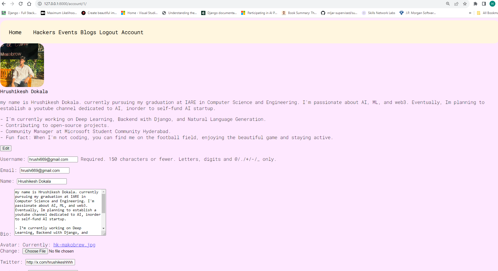
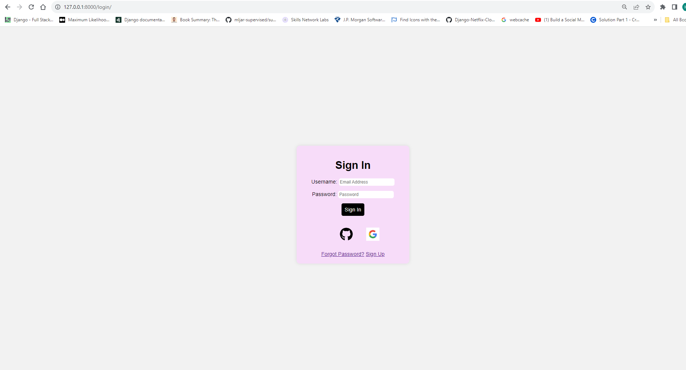
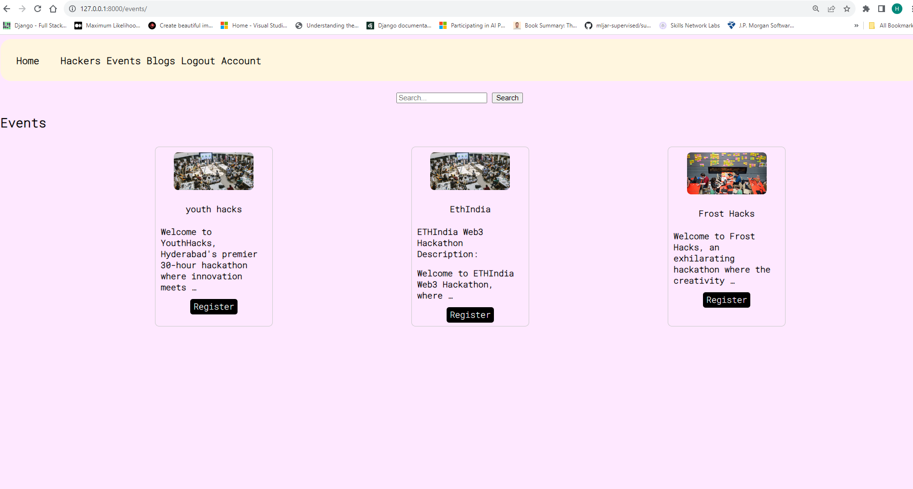
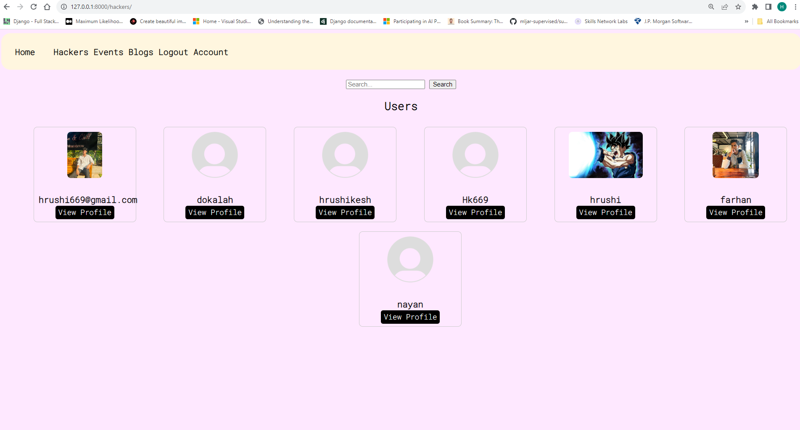
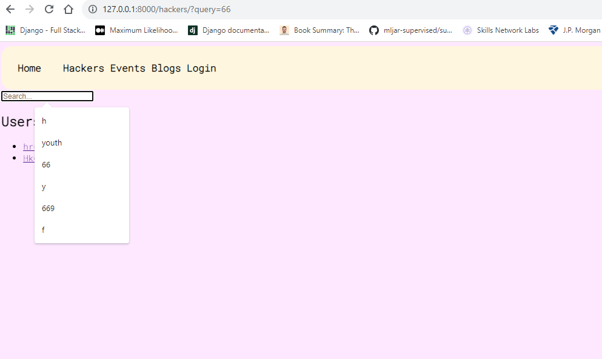
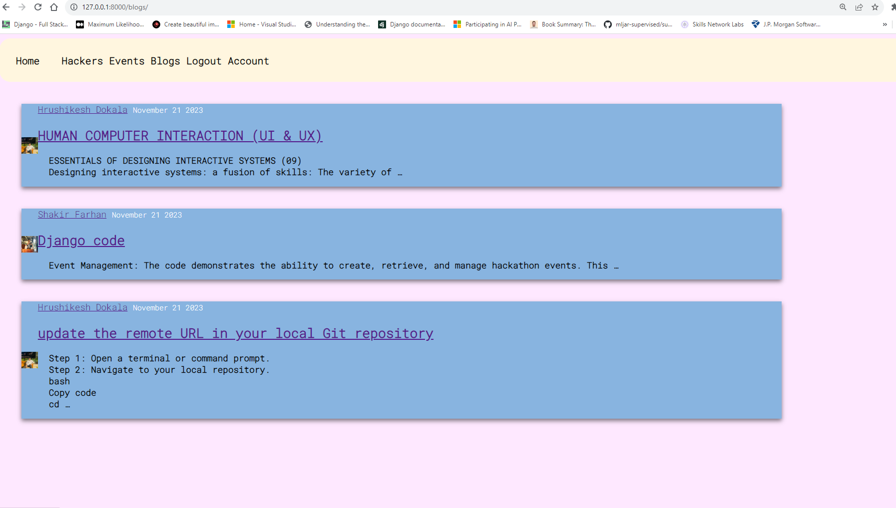

# HacksArena - Event App

HacksArena is an event management application designed to streamline the organization and participation in hackathons. Whether you are hosting a hackathon or looking to participate, HacksArena provides a centralized platform to manage events, connect with participants, and stay updated on upcoming hackathons. the application is completely built on `Azure postgresSQL` with `Django`.

   - Star the repo if found useful 🌟

**New feature**
#### Points System 🌟
- Now, every action in HacksArena comes with a reward:

   - Share your wisdom with a blog? `Earn 35🌟`
   - Log in and stay connected? `Grab 10🌟`
   - Register for an event? `Score a whopping 40🌟`
   - Submit a project? `Get ready for 100🌟`

#### Blog CKeditor
   - for more detailing of the blog content
   - all the tex features are updated

#### Social Media Share
   - `Twitter`
   - `Whatsapp`

#### Slug Field
   - added the slug for the url to avoid the ids

## Features

- **User Registration and Authentication:**
  - Users can create accounts on HacksArena.
  - Social account login support for GitHub and Google.
  - Password setting for users who sign up with social accounts.

- **Event Management:**
  - Hosts can create and manage hackathon events.
  - Participants can explore and register for upcoming hackathons.

- **Event Details:**
  - Detailed information about each hackathon, including date, time, location, and description.

- **User Profiles:**
  - Participants can create profiles showcasing their skills and interests.
  - Search functionality to find and connect with other users.

- **Blog Management:**
   - The code exhibits the capabilities of creating, reading, updating, and deleting blog posts. This enables users to share 
   - their experiences, insights, and tips related to hackathons.

- **Implemented redis cache**
   - cache for the blog posts
   - events information

- **Search Functionality:**
   - Search for hackathons based on titles and descriptions.
   - Search for users based on usernames and names.

## Getting Started

### Prerequisites

- `Python` (version 3.11.5 recommended)
- `Django` (version 4.1.13 recommended)
- `Djongo` (for MongoDB integration)

### Installation

1. Clone the repository:

   ```bash
   git clone https://github.com/Hk669/HacksArena.git
   cd HacksArena
   ```

2. Install dependencies:

   ```bash
   pip install -r requirements.txt
   ```

### Configuration

```bash

export SECRET_KEY="your-secret-key"
export CLIENT_ID="client-id"
export SECRET_GITHUB="client-secret"

```
### For redis cache
```bash

# in the ubuntu

curl -fsSL https://packages.redis.io/gpg | sudo gpg --dearmor -o /usr/share/keyrings/redis-archive-keyring.gpg

sudo apt-get update
sudo apt-get install redis

```
---

Lastly to start the redis server like so:
```bash

sudo service redis-server start

redis-cli
# 127.0.0.1:6379> ping
# PONG

```

3. Run migrations:

   ```bash
   python manage.py migrate
   ```

4. Start the development server:

   ```bash
   python manage.py runserver
   ```

5. Access the application at [http://127.0.0.1:8000/](http://127.0.0.1:8000/).

## Run on DOCKER

- **Create a file** `Dockerfile`

```bash
   FROM python:3

   ENV PYTHONUNBUFFERED 1

   RUN mkdir /hacksarena
   WORKDIR /hacksarena
   COPY . /hacksarena/
   RUN pip install -r requirements.txt

```

- Add to `docker-compose.yml` **to Build the Image**

```bash
   version: '3.9'

   services:
   web:
      build: .
      command: python manage.py runserver 0.0.0.0:8000
      volumes:
         - .:/hacksarena
      ports:
         - "8000:8000"
```

- Build the Docker Image:

```bash
   # Builds the Docker Image
   docker-compose build

   # Run migrations
   docker-compose run web python manage.py migrate

   # Start the Docker Container
   docker-compose up
```

After executing these commands, your HacksArena application will be `containerized`, and the development server will start. Access the application at [http://127.0.0.1:8000/](http://127.0.0.1:8000/).

   > Note: Containerization allows you to run the application in a consistent and isolated environment, ensuring seamless deployment.


## Usage


   **User Profile**
   - Edit the user profile 
---


   **Points System**
   - Points are displayed on the User profile

---


1. **User Registration:**
   - Create an account on HacksArena.
   - Use social accounts (GitHub, Google) for quick registration.
---


2. **Explore Events:**
   - Browse upcoming hackathons.
   - View detailed information about each event.
---

3. **Event Registration:**
   - Register for hackathons you're interested in.
---


4. **User Profiles:**
   - Create and customize your user profile.
   - Connect with other participants.
---


5. **Search Functionality:**
   - Use the search feature to find hackathons or users.
---


6. **Blog Management:**
   - The code exhibits the capabilities of creating, reading, updating, and deleting blog posts. This enables users to share 
   - their experiences, insights, and tips related to hackathons.

---


## License

This project is licensed under the [MIT License](LICENSE).

## Contact

If you have any queries, encounter issues, or need assistance, feel free to reach out to me.

**Email:** hrushikesh.dokala@studentambassadors.com

## Acknowledgments

- The project can be used both on sql and also mongoDB.

---
